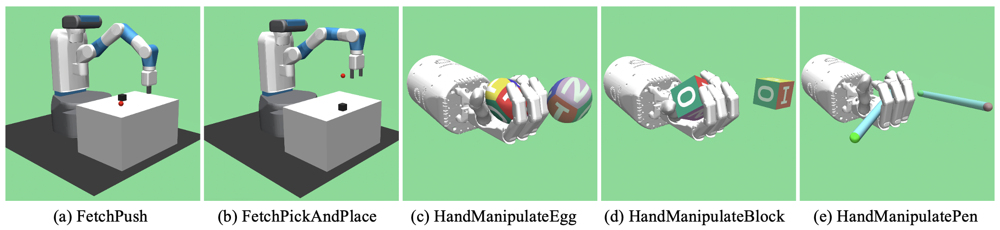

# Diversity-based Trajectory and Goal Selection with Hindsight Experience Replay 
This is the official implementation of our paper ["Diversity-based Trajectory and Goal Selection with Hindsight Experience Replay"](https://link.springer.com/chapter/10.1007/978-3-030-89370-5_3) [PRICAI 2021][[arxiv](https://arxiv.org/abs/2108.07887)][[slide](slides/PRICAI_2021.pdf)].
## 
 
## Pre-requisites  
- python==3.6.8
- gym==0.12.5
- mujoco-py==2.0.2.0
- tensorflow==1.13.1
## Installation 
1. Install the OpenMPI: 
```bash
sudo apt-get install openmpi-bin openmpi-doc libopenmpi-dev
```
2. Install the required python packages.
3. Install `baseline`:
```bash
pip install -e .
```
## Usage
Enter to the specific location:
```
cd ./baselines/her/experiment
```
The scripts for FetchEnv:
```
python train.py --env_name FetchPush-v1 --clip_div=0.001 --use_kdpp True --prioritization diversity --seed 0 --n_epochs 50 --num_cpu 16 --logdir logs/fetchpushv1/cpu16ep50/alg=DDPG+DTGSH=/r0 --logging True
python train.py --env_name FetchPickAndPlace-v1 --clip_div=0.001 --use_kdpp True --prioritization diversity --seed 0 --n_epochs 50 --num_cpu 16 --logdir logs/fetchpickv1/cpu16ep50/alg=DDPG+DTGSH=/r0 --logging True
```
The scripts for HandEnv:
```
python train.py --env_name HandManipulateEggFull-v0 --use_kdpp True  --prioritization diversity --seed 0 --goal_type full --sigma 0.1 --n_epochs 50 --num_cpu 16 --logdir logs/handegg1/cpu16ep50/alg=DDPG+DTGSH=/r0 --logging True
python train.py --env_name HandManipulateBlockRotateXYZ-v0 --use_kdpp True  --prioritization diversity --seed 0 --goal_type rotate --sigma 0.1 --n_epochs 50 --num_cpu 16 --logdir logs/handblock1/cpu16ep50/alg=DDPG+DTGSH=/r0 --logging True
python train.py --env_name HandManipulatePenRotate-v0 --use_kdpp True --prioritization diversity --seed 0 --goal_type rotate --sigma 0.1 --n_epochs 50 --num_cpu 16 --logdir logs/handpen1/cpu16ep50/alg=DDPG+DTGSH=/r0 --logging True
```
## Acknowledgements
- [@ruizhaogit](https://github.com/ruizhaogit) for [Priority-based Experience Replay](https://github.com/ruizhaogit/EnergyBasedPrioritization)
- [@openai](https://github.com/openai) for [Baselines](https://github.com/openai/baselines)
- [@satwik77](https://github.com/satwik77) for [Original DPP Implementation](https://github.com/satwik77/pyDPP)
## BibTex
To cite this code for publications - please use:
```
@inproceedings{dai2021her
	author={Dai, Tianhong and Liu, Hengyan and Arulkumaran, Kai and Ren, Guangyu and Bharath, Anil Anthony},
	title={Diversity-Based Trajectory and Goal Selection with Hindsight Experience Replay},
	booktitle={Pacific Rim International Conference on Artificial Intelligence},
	year={2021},
	pages={32--45},
	publisher={Springer},
}
```